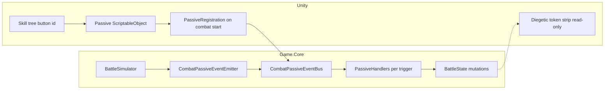

# Passivas: estado atual e arquitetura proposta (eventos + SO)

## Estado atual dos tokens e DOTs (relevante para passivas)

**Simulação (Game.Core)** — fonte de verdade em combate:

- **`TokenType`** + **`Combatant.Tokens`** (`TokenEntry` stacks): Block, Combo, Taunt, Stun, etc.
- **`DotType`** + **`Combatant.Dots.ActiveDots`**: Bleed, Blight, Burn (turnos/potência por instância).
- Passivas já mexem em tokens via **`PassiveRuleApplier.ApplyTurnStartPassives`** e **`ExtraTokenOnSelfSkill`** (entre outros).

**Unity — UI diegética (implementado)**

- [`TokenVisualCatalog`](../../Assets/_Project/Scripts/Combat/Tokens/TokenVisualCatalog.cs): catálogo único com entradas para **`TokenType`** e **`DotType`** (sprites/cores).
- [`DiegeticTokenStripPresenter`](../../Assets/_Project/Scripts/Combat/Tokens/DiegeticTokenStripPresenter.cs): lê **`Combatant.Tokens`** e **`Combatant.Dots`** via estado da batalha; não usa `TokenContainerController`.
- [`CombatDiegeticTokenStripsBinder`](../../Assets/_Project/Scripts/Combat/Tokens/CombatDiegeticTokenStripsBinder.cs): instancia strips por combatente; opcional canvas partilhado na cena + [`DiegeticTokenStripWorldFollower`](../../Assets/_Project/Scripts/Combat/Tokens/DiegeticTokenStripWorldFollower.cs).

**Unity — sistema paralelo (legado / não é PassiveDefinition)**

- [`TokenContainerController`](../../Assets/_Project/Scripts/Token/Concrete Implementations/Container/TokenContainerController.cs) + [`IPassiveSynergy`](../../Assets/_Project/Scripts/Token/Contracts/Synergies/IPassiveSynergy.cs): “passivo” no nome significa **ticks em tokens UI antigos**, não `PassiveDefinition` do Core.

**Implicações para a refatoração de passivas**

1. **Novos gatilhos tipo `OnTokenApplied` / `OnComboConsumed`** devem reagir ao **mesmo estado** que o simulador já mantém (`BattleState` + eventos `Emit`), não ao strip Unity.
2. **`RaiseTokenApplied`-style** já existe (`BattleEventType.TokenApplied`); falta **filtrar por `TokenType`** e **ator vs alvo** de forma sistemática para handlers de passiva (canal B abaixo).
3. **DOTs**: para passivas que dependem de “tinha Bleed no alvo”, o Core já usa `PassiveRuleApplier.CountDotStacks`; eventos futuros podem emitir **`RaiseDotApplied`** apenas se quiseres simetria com tokens — não é obrigatório para migrar o MVP.

---

## Como funcionam as passivas hoje

### Fonte de dados e desbloqueio

- Definições em [`Assets/StreamingAssets/Data/passives.json`](../../Assets/StreamingAssets/Data/passives.json) (cópia em [`Game.Simulations/Data/passives.json`](../../Game.Simulations/Data/passives.json)), desserializadas para [`PassiveDefinition`](../../Game.Core/Models/PassiveDefinition.cs).
- O **ID** da passiva deve coincidir com o nó **Passive** na skill tree (comentário em `PassiveDefinition`).
- Em combate: só entram passivas com `Id` em **`Combatant.Progression.UnlockedNodes`** `true` **e** existe entrada em **`BattleState.PassivesById`** (catálogo na criação da batalha).
- [`BattleFactory.CreateSampleBattle`](../../Game.Core/Engine/BattleFactory.cs) pode marcar **todos** os nós do catálogo nos aliados (`unlockAllPassiveNodesForAllies`) — útil para protótipo/testes (efeitos como Combo no início do turno vêm daqui + dados em `passives.json`).

### Onde a lógica corre (não é Observer hoje)

- [`PassiveRuleApplier`](../../Game.Core/Passives/PassiveRuleApplier.cs): classe **estática**, `switch` por [`PassiveEffectKind`](../../Game.Core/Passives/PassiveSystemContracts.cs), `EnumerateActivePassives(actor, state)`.
- [`BattleSimulator`](../../Game.Core/Engine/BattleSimulator.cs) invoca em pontos fixos:
  - Início do turno: **`ApplyTurnStartPassives`**
  - Dano: **`AccumulateOutgoingDamageModifiers`**, **`AccumulateIncomingDamageMultiplier`**
  - Após dano: **`Emit(DamageApplied)`**, **`OnOutgoingHitSuccess`**
  - Efeitos da skill: **`AdjustDotDuration`**, **`ApplyPostSkillPassiveExtras`**, DOT extra condicional
  - Tick DOT: **`GetDotTickDamageMultiplier`**

### Eventos já existentes (finos para UI/log)

- [`BattleEventType`](../../Game.Core/Domain/Enums.cs) + `Emit(...)`: `BattleStarted`, `TurnStarted`, `ActionUsed`, `HitResolved`, `DamageApplied`, `TokenApplied`, `CombatantDied`, `CorruptionAdjusted`, …
- **Não há** hoje eventos dedicados “OnHitTaken genérico”, “OnTurnEnd”, distinção explícita token aplicado ao self vs outro em **camada de passivas** (só payload nos eventos brutos).

### Código morto / paralelo

- [`PassiveHook`](../../Game.Core/Passives/PassiveSystemContracts.cs), `PassiveEvaluationContext`, `IPassiveRule`: **não usados** pelo `BattleSimulator`.
- Unity **tokens ricos** (`TokenContainerController`) ≠ **PassiveDefinition** do Core.

### CombatPrototypeController

- [`CombatPrototypeController.Start`](../../Assets/_Project/Scripts/Combat/CombatPrototypeController.cs): apenas carrega JSON de skills/passivas e passa o dicionário ao `BattleFactory`. **Sem** regras de passiva — adequado manter assim; registo futuro via bootstrap dedicado.

---

## Lacunas face às categorias desejadas

| Categoria desejada | Situação atual |
|-------------------|----------------|
| **ValorFlat** (+MaxHp, +Speed) | Não implementado; stats em [`Combatant`](../../Game.Core/Models/CombatantComponents.cs). |
| **OnHit** / **OnHitSpecificSkill** | Coberto por vários `PassiveEffectKind` fragmentados; não um único evento “OnHit”. |
| **OnHitTaken** | Só multiplicador entrante por HP baixo; sem hook genérico no defensor após dano. |
| **OnTokenReceived / OnTokenApplied** | `TokenApplied` existe nos eventos; passivas não subscrevem — tokens aplicados em **`ApplyEffects`** sem ramo de passiva genérico. |
| **OnEnemyKilled** | `CombatantDied` emitido; passivas não reagem. |
| **OnHealthLowerThan / HigherThan** | Padrão só para mult. dano recebido abaixo de limiar. |
| **OnTurnEnd** | Não há simetria a `TurnStarted`. |
| **OnComboApplied** | Combo acoplado a **`ComboBonus`** na skill + stacking em `Tokens`; sem evento explícito “consumiu Combo no alvo”. |

*(Nota: “OnHealthHigherThan” no desenho original assumia limiar “maior que X%”.)*

---

## Direção de arquitetura

### 1) Duas camadas

- **Game.Core**: contratos de eventos, payloads, registo de handlers, mutação de **`BattleState`** — mantém [`Game.Tests`](../../Game.Tests/UnitTest1.cs) sem Unity.
- **Unity**: `ScriptableObject` por passiva (ou família) com `passiveNodeId` + bootstrap na entrada da batalha (**não** no `CombatPrototypeController`).

### 2) Observer no Core

Introduzir **`CombatPassiveEventBus`** (nome ilustrativo):

- **`RaiseXxx(...)`** chamados só a partir do **`BattleSimulator`** (ou emitter fino).
- Handlers por **`PassiveTrigger`** alinhado às categorias.
- Filtro: **`PassivesById` + `UnlockedNodes`** (equivalente a `EnumerateActivePassives`).

### 3) Canal A vs B

- **A)** Estender `BattleEventType` + um subscriber que traduz para passivas.
- **B)** Canal **`CombatPassiveEvent`** separado de UI/log — **preferível** para testes e clareza; o `Emit` atual continua para narrative/UI.

### 4) ScriptableObject e skill tree

- Asset referencia **`passiveNodeId`** igual ao botão da árvore.
- **Uma fonte de verdade**: SO exporta JSON **ou** runtime só Core — evitar regras duplicadas.

### 5) Bootstrap Unity

- **`CombatPassiveRegistrationService`** (nome ilustrativo): subscreve ao [`CombatSessionHub`](../../Assets/_Project/Scripts/Combat/CombatSessionHub.cs) `OnCombatSessionReadyForUi`, regista handlers no bus com dados dos SO / árvore desbloqueada.

---

## Migração sugerida (fases)

1. **Inventário de emissões** no [`BattleSimulator`](../../Game.Core/Engine/BattleSimulator.cs): onde **`RaiseOnHit`**, **`RaiseDamageTaken`**, **`RaiseTurnEnd`**, **`RaiseDeath`**, **`RaiseTokenDelta`** (com actor/target/skill), e mapeamento para [`PassiveEffectKind`](../../Game.Core/Passives/PassiveSystemContracts.cs) atual.
2. **Bus + migração** de `PassiveRuleApplier` para handlers por gatilho; **testes verdes**.
3. **Novos gatilhos** para lacunas (stats flat, crítico condicional, token ao receber dano, kill reward, combo consumido explicitamente se necessário).
4. **Unity**: `PassiveDefinitionAsset` + registrador na cena.
5. **Limpeza**: remover/fundir `PassiveHook` / `IPassiveRule` antigos.

---

## Diagrama (alvo)

*(UI de tokens apenas **lê** estado; não regista passivas.)*

---

## Risco / decisão em aberto

- **Persistência**: modificadores **ValorFlat** só na batalha vs progressão permanente — define se vivem só em `BattleState` ou também em save.

---

## Relação com o plano de tokens

O plano [`token-system-diegetic-ui.plan.md`](token-system-diegetic-ui.plan.md) cobre **apresentação**. Esta refatoração de passivas **não** deve mover lógica para o strip Unity; qualquer passiva baseada em tokens/DOTs continua no **Core**, eventualmente disparada pelo **event bus** quando tokens ou DOTs mudam **no mesmo sítio** onde hoje se chama `Tokens.Add` / `Dots.ActiveDots.Add`.
