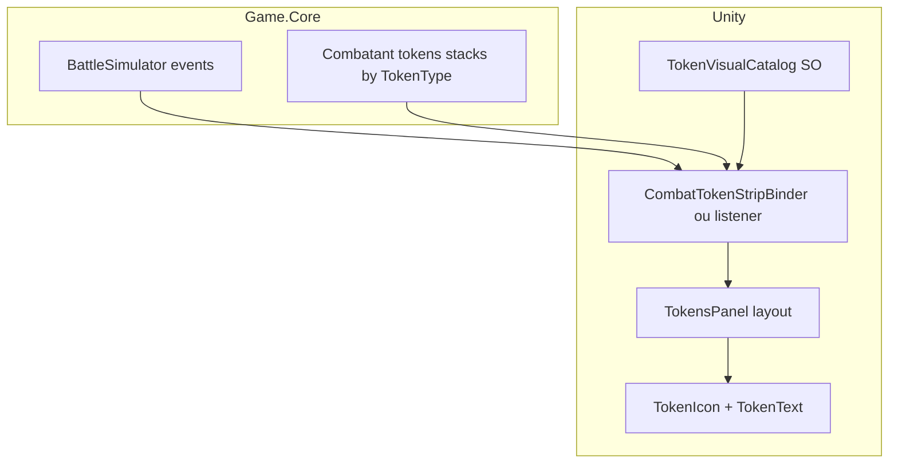

# Plano: sistema de tokens + UI diegética

## Estado atual (código)

- **Simulação:** `[TokenType](Game.Core/Domain/Enums.cs)` em **Game.Core** com stacks em `[TokenEntry](Game.Core/Models/CombatantComponents.cs)` / componente de tokens do combatente. Os eventos de combate já incluem `BattleEventType.TokenApplied` (útil para UI/log).
- **Unity — modelo rico:** `[TokenContainerController](Assets/_Project/Scripts/Token/Concrete Implementations/Container/TokenContainerController.cs)` + subclasses de `[TokenController](Assets/_Project/Scripts/Token/Concrete Implementations/TokenController.cs)` por tipo, com stacking (`LinearStackData`, etc.) e **synergies**. `[TokenContainerView](Assets/_Project/Scripts/Token/Concrete Implementations/Container/TokenContainerView.cs)` usa **Addressables** e um **grid** com um spawn por token **alocado** (não corresponde ao teu layout horizontal só com `HorizontalLayoutGroup`).
- **Gap:** Em vários modos de stack (ex.: `LinearStackData`), **não é criado novo visual**, mas também **não há evidência no código de atualização do texto de stacks** no objeto existente — risco de UI dessincronizada.
- **Combat:** Scripts em `Combat/` referem `Game.Core` tokens para regras (ex.: taunt); **não há** wiring automático visível entre essa simulação e `TokenContainerController` nos resultados do grep — ou seja, **duas pilhas conceituais** possíveis até consolidares.

## Objetivo de UX (o que descreveste)

- **TokenCanvas** (World Space, pequeno) → **TokensPanel** (`HorizontalLayoutGroup`) → filhos **TokenIcon** (imagem) → **TokenText** (contagem ou label curto).
- Ao **spawn** do personagem, instanciar o painel **como filho** acima do modelo; **durante a partida**, atualizar ícones/textos conforme stacks.

Isto sugere naturalmente **um ícone por tipo de token presente** (ou por tipo sempre visível com count 0 — decisão de design), não um prefab por “instância física” de token como o grid atual.

## Opções de dados: ScriptableObject vs alternativas

| Abordagem                                                                                                                    | Prós                                                                    | Contras                                                  |
| ---------------------------------------------------------------------------------------------------------------------------- | ----------------------------------------------------------------------- | -------------------------------------------------------- |
| **A — Um `ScriptableObject` por `TokenType`** (ex.: `BlockTokenVisual.asset`)                                                | Simples de arrastar para slots; overrides por projeto; bom para equipas | Muitos assets; renomear enum implica retocar referências |
| **B — Um único `TokenVisualCatalog` SO** com array/lista `TokenVisualDefinition` (`TokenType` + sprite + cores + nome curto) | Um sítio só para balance art/UI; fácil export/table                     | Um asset grande; merge em equipa pode conflitar          |
| **C — Sem SO: Addressables por chave `TokenType.ToString()`**                                                                | Menos assets                                                            | Frágil a refactors; designers dependem de nomes          |
| **D — JSON + Addressables** (similar ao resto do projeto)                                                                    | Versionável                                                             | Menos conveniente no Inspector para arte                 |

**Recomendação pragmática:** **B (catálogo único)** ou **A** se quiseres arte muito distinta por tipo e prefabs diferentes por token. Para **ícone + texto**, **B** costuma bastar: uma linha por entrada em `TokenType`.

Os **comportamentos** (synergies, stacking) podem continuar nas classes `TokenController` existentes; o SO deve cobrir sobretudo **apresentação** (`Sprite`, `Color`, string curta, opcional prefab de ícone se não for só `Image`).

## Fluxo de apresentação recomendado

1. **Fonte de verdade:** Preferir **Game.Core** stacks durante combate **prototype** que já usa o simulador; disparar atualização em cada `TokenApplied` / turno / `DamageApplied` conforme precisão desejada.
2. **Binder:** Um componente no **TokensPanel** que recebe `Combatant` ou `string combatantId` + referência ao estado da batalha (hub/session), e:
  - Para cada `TokenType` com stacks > 0 (ou todos os tipos que queres mostrar), garante um **TokenIcon** na lista (object pooling opcional).
  - Atualiza **TokenText** com `GetStacks(TokenType)` (ou texto “∞” / timer se no futuro tiveres duração só em UI).
3. **Evitar** duplicar números entre `TokenContainerController.model` e Game.Core sem contrato — ou **unificas** (sim só Core + SO visuals), ou defines **adaptador** que traduz eventos Core → chamadas ao container existente.

## Hierarquia / spawn

- **Prefabs:** Raíz do character inclui referência ao prefab **TokenCanvas** (ou só **TokensPanel**) posicionado acima da cabeça (empty `Anchor` no skeleton).
- **Billboard:** Opcional — script opcional para o canvas olhar para a câmara (Cinemachine-friendly).
- **Escalabilidade:** Canvas world-space com escala fixa pequena; **CanvasScaler** pode ajudar entre resoluções.

## Relação com `TokenContainerView` atual

- **Substituir** o grid por um novo `**TokensStripView`** (nome sugerido) que implementa o layout horizontal e atualização por tipo **OU**
- **Adaptar** `TokenContainerView` para, em vez de `AddTokenToView` spawnar sempre novo cubo, **resolver slot por tipo** e atualizar stack no mesmo `TokenIcon`.

Sem uma decisão aqui, arriscas dois sistemas visuais paralelos.

## Ordem de trabalhos sugerida

1. **Decisão de arquitetura:** estado em Core apenas para combate atual. Descarte as mecânicas de sinergia de token
2. **Catálogo visual** (`TokenVisualCatalog` ou SOs por tipo) + enum `TokenType` coberto no Inspector (warning se faltar entrada).
3. **Prefab** TokensPanel + TokenIcon pool ou dictionary `TokenType → instance`.
4. **Binder** ligado ao fluxo de combate existente (idealmente via componente dedicado no prefab do combatente, **não** lógica pesada no `CombatPrototypeController`).
5. **Testes manuais / playmode:** stacks que sobem/descem, taunt, combo, block múltiplos.
6. **Limpeza:** remover ou isolar Addressables grid antigo se já não for usado.

## Riscos / decisões em aberto

- **Synergies Unity-only:** Use apenas um stacking simples, certos tipos de tokens perdem 1 stack por turno e x de dano por stack ou truno.
- **Performance:** Poucos tipos em campo — dictionary por tipo é suficiente; pooling só se instanciares/destruíres muito.

---

*Este plano foca terminar o sistema de tokens + UI diegética antes da refatoração de passivas por eventos.*