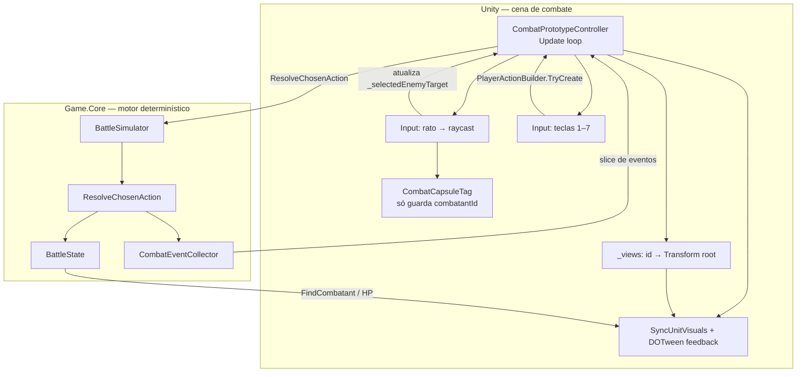

# ⚔️ Erumperem

Projeto Unity com simulação de combate em .NET para análise e balanceamento.

---

## Arquitetura: código .NET “fora” da Unity vs Unity


| Onde                                         | Nome técnico (inglês, uso comum)                                                           | Neste repositório                                                                                                  |
| -------------------------------------------- | ------------------------------------------------------------------------------------------ | ------------------------------------------------------------------------------------------------------------------ |
| Lógica de combate, modelos, simulador, dados | **Core library** / **game logic assembly** / **domain layer** (biblioteca .NET partilhada) | Projeto `**Game.Core`** — DLL compilada; alvo `**netstandard2.1**` para o Unity e `**net8.0**` para testes/CLI     |
| Correr batalhas sem Unity                    | **Headless host** / **console app**                                                        | `**Game.Simulations`** — referencia `Game.Core`                                                                    |
| Testes automáticos                           | **Unit / integration tests**                                                               | `**Game.Tests`** — referencia `Game.Core`                                                                          |
| Cena, input, prefabs, orquestração visual    | **Unity layer** / **presentation & integration** (scripts `**MonoBehaviour`**)             | `Assets/_Project/Scripts/...` — o Unity é o **host** que carrega o core como **managed plugin** (DLL em `Plugins`) |


### Alterei `Game.Core`. Tenho de “buildar tudo”?

- **Para testes e simulação (`dotnet test`, `dotnet run` em `Game.Simulations`):** não precisas de um passo extra manual para o `Game.Core` — `Game.Tests` e `Game.Simulations` têm **referência de projeto** ao `Game.Core`; um `dotnet build` nesses projetos (ou na solução) **recompila o `Game.Core` automaticamente**.
- **Para o Editor Unity usar a nova lógica:** sim — o Unity **não compila** o `Game.Core` a partir do `.csproj`. Tens de **voltar a publicar** o assembly (e dependências) para a pasta de plugins (ver abaixo). Sem isso, o Unity continua com a DLL antiga.
- **Se só alteraste scripts `.cs` dentro de `Assets/`:** o Unity compila isso sozinho; **não** precisas do script de publish do `Game.Core`.

### Como as DLLs entram no Unity

O script `tools/PublishGameCoreForUnity.ps1` executa `dotnet publish` do `Game.Core` em `**netstandard2.1` (Release)** e copia o output para:

`Assets/_Project/Plugins/GameCore/`

Aí ficam `Game.Core.dll`, `System.Text.Json` e outras dependências necessárias. No Unity, isso aparece como **Plugin** importado automaticamente; após copiar, abre o projeto no Unity (ou faz **Assets → Refresh**) para reimportar se necessário.

---

## Arquitetura do fluxo de jogo (input → motor → visual)

Hoje existem **dois mundos** no projeto, com loops diferentes:


| Contexto                                        | O que recebe input                                                                           | O que muda no ecrã                                                                                                                                     |
| ----------------------------------------------- | -------------------------------------------------------------------------------------------- | ------------------------------------------------------------------------------------------------------------------------------------------------------ |
| **Exploração / overworld** (ex.: `MovimentoXZ`) | `Keyboard` + `Rigidbody` no **próprio** GameObject do jogador                                | Posição/rotação do corpo; **não** passa pelo combate `Game.Core`.                                                                                      |
| **Cena de combate protótipo**                   | Um `**MonoBehaviour` orquestrador** na cena (`CombatPrototypeController`) lê mouse e teclado | O estado (`BattleState`) muda no **motor**; as **cápsulas** na cena só têm `**CombatCapsuleTag`** (id do combatente) para raycast + mapeamento visual. |


**Ideia-chave no combate:** o prefab da unidade **não** processa dano. Só expõe um **id** (`combatantId`) para o raio bater no collider. O **único** script que “entende” combate, turnos e dano é o **orquestrador** + `**BattleSimulator`** (DLL `Game.Core`).

### Diagrama (alto nível)




### Três exemplos essenciais (caminho completo)

#### 1) Rato: escolher **alvo inimigo** (não aplica dano)

1. `CombatPrototypeController.Update` chama `PickTargetFromMouse()`.
2. Raycast na `Main Camera` → `CombatCapsuleTag` no collider da cápsula lê `combatantId`.
3. O controller procura esse id em `_state.Enemies` e grava `**_selectedEnemyTarget`**.
4. O **motor ainda não** corre; só fica pronto para a próxima skill que precise de alvo inimigo.

*(Clicar num **aliado** atualiza texto de ajuda / hotbar via `CombatPresentationHub`, também sem resolver dano.)*

#### 2) Teclas **1–7**: skill do herói → **dano no motor** → **cápsula encolhe / anima**

1. Quando é a vez do jogador, `AdvanceCombatStep` mete `_needsPlayerInput` e `_pendingPlayerActor`.
2. `TryPlayerHotkeys()` vê `Keyboard.current` e monta `ChosenAction` com `PlayerActionBuilder.TryCreate(..., _selectedEnemyTarget)`.
3. `PresentActionRoutine` chama `**_sim.ResolveChosenAction(_state, action)`** (dentro de `Game.Core`): atualiza HP, emite `DamageApplied`, etc.
4. O controller lê o **slice novo** em `CombatEventCollector.Events` e, para cada `DamageApplied` com dano > 0, chama `**PlayDamageVisualFeedback(targetId)`**.
5. `PlayDamageVisualFeedback` resolve `targetId` → `**_views[targetId]**` (Transform raiz da cápsula) e corre **DOTween** (punch + `DOScaleY` se `syncHpAsVerticalScale`).
6. **Cada frame**, `SyncUnitVisuals()` alinha escala Y com `CurrentHp/MaxHp` **exceto** enquanto o alvo está em `_damageFeedbackBusy` (para não lutar com o tween).

#### 3) Turno da **IA**: mesmo pipeline, **sem** teclado do jogador

1. `AdvanceCombatStep` vê que o ator **não** é controlado pelo jogador.
2. `ChooseAiAction` no `BattleSimulator` escolhe skill + alvo.
3. Arranca a mesma `**PresentActionRoutine`** (coroutine) com a ação escolhida → `ResolveChosenAction` → eventos → feedback visual como no exemplo 2.

---

## Build, testes e publish para Unity (comandos essenciais)

Na **raiz do repositório** (onde está `Erumperem.Combat.sln`):


| O quê                                                                             | Comando                                                                      |
| --------------------------------------------------------------------------------- | ---------------------------------------------------------------------------- |
| Compilar **toda a solução** (.NET)                                                | `dotnet build Erumperem.Combat.sln`                                          |
| Compilar em **Release**                                                           | `dotnet build Erumperem.Combat.sln -c Release`                               |
| Correr **testes**                                                                 | `dotnet test Game.Tests/Game.Tests.csproj`                                   |
| **Publicar `Game.Core` para o Unity** (DLLs → `Assets/_Project/Plugins/GameCore`) | `powershell -ExecutionPolicy Bypass -File tools/PublishGameCoreForUnity.ps1` |


Equivalente sem o script (mesmo resultado que o PowerShell):

```bash
dotnet publish Game.Core/Game.Core.csproj -c Release -f netstandard2.1 /p:CopyLocalLockFileAssemblies=true -o Assets/_Project/Plugins/GameCore
```

**Fluxo típico para quem mexe no motor de combate e testa no Unity:** editar `Game.Core` → `dotnet test` (opcional mas recomendado) → `powershell -File tools/PublishGameCoreForUnity.ps1` → abrir/atualizar o projeto no Unity.

---

## 📂 Dados do jogo

Os ficheiros JSON usados pelo carregamento de dados ficam em:

`Game.Simulations/Data/`


| Ficheiro           | Conteúdo             |
| ------------------ | -------------------- |
| `skills.json`      | Definições de skills |
| `enemies.json`     | Inimigos             |
| `skill_trees.json` | Árvores de skills    |


Por defeito a simulação carrega `skills.json` via `CombatDataLoader.ResolveDefaultSkillsPath()` (funciona a partir de `Game.Simulations` ou `Game.Tests`). As **passivas** dos nós estão em `skill_trees.json` para progressão/UI; o motor de combate atual aplica só **skills ativas** (incluindo as inatas do Wulfric). Ver `docs/wulfric-skill-trees.md` e a especificação de talentos em `docs/passives-system-spec.md`.

---

## 🎲 Simulação headless (CLI)

O projeto `Game.Simulations` corre batalhas em lote e gera CSVs de eventos e agregados (win rate por skill, etc.).

Na **raiz do repositório**, usa `dotnet run` com `--` para passar argumentos ao programa:

### Comandos úteis


| O quê                                             | Comando                                                                                                                    |
| ------------------------------------------------- | -------------------------------------------------------------------------------------------------------------------------- |
| 🏃 Correr **50** batalhas                         | `dotnet run --project Game.Simulations/Game.Simulations.csproj -- --battles 50`                                            |
| 🎰 Outra sequência “aleatória” (muda a seed base) | `dotnet run --project Game.Simulations/Game.Simulations.csproj -- --battles 50 --seed 12345`                               |
| 📁 Gravar CSV noutra pasta                        | `dotnet run --project Game.Simulations/Game.Simulations.csproj -- --battles 50 --out "C:\caminho\para\pasta"`              |
| 📜 Usar skills de um JSON                         | `dotnet run --project Game.Simulations/Game.Simulations.csproj -- --battles 10 --skills Game.Simulations/Data/skills.json` |


**Nota:** o `--` separa os argumentos do `dotnet` dos argumentos da simulação.

### ⚙️ Argumentos


| Argumento      | Default        | Descrição                                    |
| -------------- | -------------- | -------------------------------------------- |
| `--battles`    | `100`          | Número de batalhas                           |
| `--seed`       | `42`           | Seed base (cada batalha usa `seed + índice`) |
| `--out`        | *(ver abaixo)* | Pasta de saída dos CSV                       |
| `--skills`     | *(embutido)*   | Caminho para `skills.json`                   |
| `--enemies`    | *(opcional)*   | Caminho para `enemies.json`                  |
| `--skillTrees` | *(opcional)*   | Caminho para `skill_trees.json`              |


---

## 📤 Onde fica o output

Por defeito, os CSV são escritos em:

`**Game.Simulations/SimulationOutput/`**

Ficheiros gerados:


| Ficheiro                | Conteúdo                                                    |
| ----------------------- | ----------------------------------------------------------- |
| `combat_events.csv`     | Todos os eventos de combate (linha a linha)                 |
| `combat_aggregates.csv` | Agregados por skill (win rate, pick rate, dano médio, etc.) |


O consola também imprime um resumo da win rate por skill ao terminar.

> 💡 Esta pasta de simulação é **regenerável**; os dados de jogo versionados continuam em `Game.Simulations/Data/`.

---

## 🧪 Testes

```bash
dotnet test Game.Tests/Game.Tests.csproj
```

---

## 🔧 Requisitos

- [.NET 8 SDK](https://dotnet.microsoft.com/download)
- Unity (versão do projeto conforme `ProjectSettings`)

