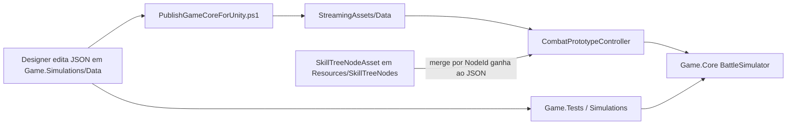
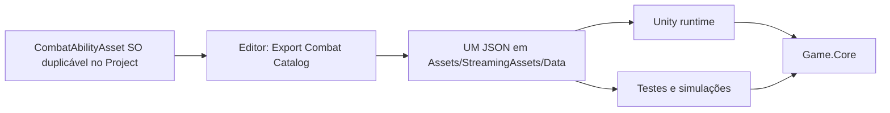

# Rework de skills — plano de implementação

Auditoria read-only. Nenhuma alteração de código nesta fase. Contrato: [`ReferenceForRework.md`](ReferenceForRework.md). Convenções de ID e authoring SO: pedido do designer (ganham sobre camelCase do spec).

## 1. Sumário executivo

### Stack actual

| Camada | Facto |
|---|---|
| Unity | 6000.3.9f1 (`ProjectSettings/ProjectVersion.txt`) |
| Motor | `Game.Core` — `net8.0` + `netstandard2.1` (Unity consome ns2.1; **sem UnityEngine**) |
| CLI / testes | `Game.Simulations` net8 exe; `Game.Tests` xunit net8 |
| Dados | JSON canónico em `Game.Simulations/Data/`; cópia byte-a-byte em `Assets/StreamingAssets/Data/` (hashes SHA256 iguais em skills/passives/skill_trees/enemies). Sync: `tools/PublishGameCoreForUnity.ps1` (Simulations → StreamingAssets) |
| Docs | `docs/skill-authoring.md` — “criar skill = editar JSON” |

### Arquitectura actual (fluxo)



Três superfícies de authoring (JSON Simulations, JSON StreamingAssets, **180** SOs em `Resources/SkillTreeNodes` — **108** no `skill_trees.json` actual, **72** legado). Merge Unity **só aplica SOs listados** em `_skillTreeAuthoringAssets`; o prefab `CombatSceneCore` tem **um** entry (`f_t1_p1` legado). `ToRuntimeSkillDefinition` omite 12+ campos (`hitCount`, follow-ups, BonusAction, `scaleFromToken`, …). Duplicar um SO **não** chega: falta JSON de árvore, botão no presenter, e o adapter é incompleto.

Overworld tem `PlayableCharacterState.Main | Companion | Resting`. Combate **não** tem `PartyRole` / Leader. `StatsComponent` não tem Defense %. Defense é só token. Corrupção T1–T3 ainda bufa dano do jogador (`CombatBalanceConfig.cs` ~46–68) — o spec manda remover isso.

Passivas de árvore no JSON **não implementam o GDD** (ex.: `w_us_t1_p1` aplica CI no Taunt, spec pede CI ao basic vs Destabilization). Ativas camelCase estão mais perto do spec. Leader / companion / corrupção por herói **ausentes**.

### Arquitectura-alvo



- Designer: duplicar `CombatAbilityAsset` (activa ou passiva), preencher Inspector, Export.
- Runtime único: `Assets/StreamingAssets/Data`. `CombatDataLoader` resolve esse path (walk-up do repo). Apagar `Game.Simulations/Data` como fonte editável.
- `Game.Core` continua Unity-free. PartyRole e BaseStats vivem no combatant. Passivas = condições + efeitos, não 13 `PassiveEffectKind` one-off.
- Overworld `Main` → combate `Leader`; `Companion` → `Companion`; Resting não entra.

---

## 2. Inventário do spec e gaps

Por herói (GDD): **13 ativas**, **32 passivas**, **3 árvores**.  
Totais: **39 ativas**, **96 passivas**, **9 árvores**.  
Não criar `*_innate_passive*` — o GDD não lista passivas inatas de kit.

| Herói | Nickname | HP | Defense base | Crit | CharacterId |
|---|---|---|---|---|---|
| Wulfric | Splintered Knight | 100 | 25% | +3% | `wulfric` |
| Buck Wyatt | Pistoleer | 85 | 17% | +5% | `buck` |
| Maria | The Star | 70 | 12% | +1% | `maria` |

### Cobertura (estado)

| Bloco | Estado | Evidência |
|---|---|---|
| Ativas inatas + árvore (camelCase) | Parcial — dados perto do spec; IDs ilegíveis | `skills.json` `wulfricBasicHit` ~982; trees `wulfricUnstable` em `skill_trees.json` ~30 |
| Passivas de árvore | Erradas / best-effort com kinds velhos | `passives.json` `w_us_t1_p1`–`p3` ~371–387 vs spec L67–69; `docs/skill-authoring.md` ~75 admite gap |
| Leader / Companion | Ausente | Sem IDs no JSON; overworld só Main/Companion |
| Corrupção por herói T1–T3 | Ausente | Corrupção global ainda é `PlayerDamageDealtMultiplier` |
| Defense % base | Ausente | `StatsComponent` só Speed/Accuracy/CritChance (`CombatantComponents.cs` ~31–36) |
| PartyRole | Ausente | `Combatant` sem role; `CombatPartyResolver.cs` ordena Main+Companion |
| Tokens de kit | Parcial | `TokenType` em `Enums.cs` ~24–50 cobre a maior parte; Confusion MVP incompleto; DOT separado |
| PermaBuff / Hypnosis / Dizzy | Ausente no motor | Lista canónica do spec L783–797 |
| Horse Boss summon | Vivo, fora do spec de kits | `horse_boss_summon_fairy_on_hp_tier` `passives.json` ~364; **não apagar** |

### Tokens (player-facing: Status)

Usados nos kits: Taunt, Controlled Instability, Destabilization, Strength, Defense, Weaken, Vulnerability, Confusion, Bleeding, Lucky Shot, Dexterity, Exposition, Corrosion, Mark, Regeneration, Clumsy.

Lista canónica extra (motor sim, kits não): Stealth, Burn, Hypnosis, Dizzy, Perma[Buff]. Blind/Fear cortados no spec — não implementar.

Vivos no código e fora do dicionário GDD (manter se usados por **inimigos**): Block, BlockPlus, Stun, Blind, BonusAction; DoT Blight; Horse Boss (4 skills `horse_boss_*` + summon). Dodge: motor vivo, **zero** conteúdo. Combo: stacks concedidas, **zero** leitor no engine — não usar em kits; não apagar o enum até limpar grants de inimigos.

---

## 3. Achados priorizados

Falsos positivos descartados:
- “Dois JSON divergentes” — hashes iguais; é **cópia sincronizada**. A duplicação ainda é dívida.
- “Destabilization precisa de radius” ([Game.Core engine audit](ae901211-f5de-4e86-8d83-6436fd9c2063)) — rejeitado; “nearby” = todos os outros vivos (decisão secção 7).
- `SimulationSkillTreeSetup` não é morto. `BuckSkillDataCloner` é legado — remover na limpeza.
- Catálogo: **82** skills / **136** passives; **55** passives (~40%) fora de qualquer árvore (`f_t*`/`b_f_*` + horse_boss). **Não apagar** as 4 skills `horse_boss_*` nem inimigos (`beacon_of_desire_*`, `corrupted_miner_*`, spiders).

| Pri | Sev | Cat | Onde | Problema | Porquê aqui |
|---|---|---|---|---|---|
| 1 | crítico | authoring | `SkillTreeNodeAsset.cs` ~72, ~307–334; `CombatPrototypeController.cs` ~860; `docs/skill-authoring.md` L1–6 | Três superfícies; SO incompleto; JSON-first | Designer não consegue duplicar um SO e ter skill real |
| 2 | crítico | gap-spec | `passives.json` `w_us_*` / `b_ar_*` / `m_lf_*`; `PassiveSystemContracts.cs` ~7–22 | 13 EffectKinds não cobrem o GDD; dados de árvore ≠ spec | 96 passivas a implementar; kinds one-off não escalam |
| 3 | crítico | party-role | `PlayableCharacterState.cs`; `CombatantComponents.cs`; spec L8–9 | Main/Companion no overworld; combate ignora role | Leader/Companion e mecânicas futuras precisam de um sítio único |
| 4 | crítico | stats | `CombatantComponents.cs` ~31–36; `CombatDamageCalculator.cs` ~83–108, ~194; spec L1–6 | Sem Defense %; mitigação é Block; round para int pode ser 0 | Spec: base def reduz X%, resultado int, min dano 1 |
| 5 | alto | id-ilegível | `skill_trees.json` `w_us_t1_p1`; `skills.json` `wulfricBasicHit`; `UnitTest1.cs` ~290 | Prefixos opacos + camelCase + órfãos `f_t*` | Contrato do designer: IDs legíveis |
| 6 | alto | duplicação | `PublishGameCoreForUnity.ps1` ~16–17; hashes iguais | Clone Simulations ↔ StreamingAssets | Confusão de fonte; o pedido manda um sítio |
| 7 | alto | token | `Enums.cs` DotType vs TokenType.Bleeding; `Scripts/Token/Exemplos/` | DOTs paralelos + framework Unity experimental | Spec unifica DoT como Status; Exemplos são bloat |
| 8 | alto | gap-spec | `CombatBalanceConfig.cs` ~46–77; spec L910–918 | Tiers ainda bufam dano in/out do player | Spec: passivas de herói T1–T3; accuracy de monstros; T4 só inimigos |
| 9 | médio | texto | `PlayerFacingText.cs` ~387–408; `PassiveSystemContracts.cs` `OutgoingDamage*` | Não há string “Outgoing Damage”; copy “deals +X% damage” | Pedido: Damage Caused nos identificadores visíveis |
| 10 | médio | token | `BattleSimulator.cs` ~417–446; spec L243 | Confusion só retargeta inimigo aleatório em skills anti-enemy | Spec: Ally↔Enemy, Self↔None por skill |
| 11 | médio | gap-spec | spec L879; `BattleSimulator.cs` ~50–53, ~272 | Extra turn existe via BonusAction mas spec diz “não devidamente implementado” | Validar + HUD de round |
| 12 | baixo | bloat | `Resources/SkillTreeNodes/` 180 assets; `f_t*`, `b_f_*`; `passives.json` ~3–316 | Órfãos + SOs legado | Limpeza fase H |
| 13 | baixo | teste | `UnitTest1.cs` `f_t1_p1`; `HeroKitSkillTests.cs` camelCase | Testes cimentam IDs mortos | Actualizar com o mapa da secção 6 |
| 14 | alto | party-role | `CombatPartyResolver.cs` ~127–133 | Se Wulfric está na lista, é **forçado a Main** | Trocar líder no overworld não chega; Fase B remove este override |
| 15 | alto | stats | `WulfricAllyCharacterStatDefinition.asset` crit 0.05; `BuckCharacterStats.asset` HP 100 | Spec: Wulfric +3%, Buck HP 85 | Base stats do GDD não estão nos SOs de aliado |
| 16 | alto | token | `BattleCombatStatusTicker.cs` ~60–90 vs spec L813 | Corrosion dá 5 dano EOT **sem** perder stack | Spec: take 5 **and lose 1 stack** |
| 17 | alto | token | `PassiveRuleApplier` grants Combo; engine 0 leitores | Combo é UI morta | Não ligar a kits; limpar grants na fase H |
| 18 | médio | authoring | `CombatSceneCore.prefab` merge = só `f_t1_p1` | 108 SOs actuais **não** entram no merge | Confirma que JSON é o que o combate usa hoje |
| 19 | médio | token | `Scripts/Token/` só em `TokenTestScene.unity` | Framework paralelo (~176 ficheiros) | Combate vivo é `Combat/Tokens/` + Game.Core |
| 20 | médio | gap-spec | `PassiveRuleApplier.cs` ~31–33 | `IfHasTokenType` só no Grant-at-turn-start | Campos de passiva mentem no Inspector |
| 21 | médio | teste | `SkillDamagePreviewCalculator.cs` vs `CombatDamageCalculator` | Preview omite accuracy de debuff/corrupção | Tooltips mentem; alinhar na fase G |
| 22 | baixo | teste | `SkillContractTests.cs:333`; `UnitTest1.cs:543` | Exigem `wulfric_innate_cleave` e `f_t1_p1` no catálogo | Bloqueiam apagar legado — migrar **antes** da limpeza |

---

## 4. Pipeline de dados escolhido

**Decisão:** ScriptableObject é a superfície do designer. JSON em `Assets/StreamingAssets/Data` é o contrato de runtime (Game.Core, Unity, testes, CLI).

1. Authoring: `Assets/_Project/ScriptableObjects/Combat/` — um `CombatAbilityAsset` por habilidade (toggle Active/Passive). Duplicar no Project window = skill nova.
2. Menu Editor `Erumperem/Combat/Export Catalog` gera `skills.json`, `passives.json`, `skill_trees.json` (e não reescreve `enemies.json` a não ser que o export de inimigos exista).
3. `CombatDataLoader.ResolveDefaultDataPath` procura, por ordem: `Assets/StreamingAssets/Data` (walk-up a partir do repo), depois `AppContext/Data` para publish CLI.
4. Apagar pasta editável `Game.Simulations/Data`. Actualizar `PublishGameCoreForUnity.ps1` para **não** copiar JSON na direcção antiga. CLI/testes leem StreamingAssets.
5. Remover merge ad-hoc SO-sobre-JSON no `CombatPrototypeController` depois do export ser a fonte (Unity carrega só JSON exportado, igual aos testes). Evita drift Inspector vs disco.
6. `enemies.json` permanece JSON (inimigos já são data-driven); não misturar com kits de herói. `horse_boss_summon_fairy_on_hp_tier` fica em passives de inimigo.

**Apagar nesta rework (depois de export funcionar):**

- `Game.Simulations/Data/*.json` (clone)
- `tools/CloneBuckSkillData.ps1`, `BuckSkillDataCloner.cs`
- Assets `Resources/SkillTreeNodes` com prefixos `f_t`, `a_t`, `m_t` (legado Maria-element), `b_f_`, `b_m_`, `b_a_`
- Entradas JSON `f_t*`, `m_t*`, `a_t*`, `b_f_*`, `b_m_*`, `b_a_*`, skills `wulfric_innate_cleave/shove/guard` e equivalentes Buck legado se não estiverem no spec
- `Assets/_Project/Scripts/Token/Concrete Implementations/Tokens/Exemplos/` (e o resto de `Scripts/Token/` na fase H)
- `PassiveEffectKind` de 13 cases (substituído pelo modelo novo; **excepto** manter operação de summon do Horse Boss como effect de inimigo)

**Não apagar:** exploração, Horse Boss (`horse_boss_*` skills + summon), inimigos em `enemies.json` / skills de miner/spider/beacon, `TokenType.BonusAction`, Block/BlockPlus/Stun/Blind **enquanto** skills de inimigo as usarem.

---

## 5. Schema alvo

Identificadores em inglês, nomes longos. Inspector: um campo = um papel.

### 5.1 `CombatantPartyRole` (Game.Core)

```
None = 0          // inimigos, summons
Leader = 1        // overworld Main
Companion = 2     // overworld Companion
```

Campo em `Combatant`: `CombatantPartyRole PartyRole`.  
Preenchimento Unity: `CombatPartyResolver` / factory de aliados — `Main`→`Leader`, `Companion`→`Companion`. Resting fora da party.  
Passivas e mecânicas futuras filtram `RequiredPartyRole: Any | Leader | Companion`. Um único sítio; proibido `if (characterName == ...)`.

### 5.2 Base stats

`StatsComponent`:

- `Speed` (já existe; combate de iniciativa)
- `Accuracy` (já existe)
- `CritChance` (já existe; spec +3% Wulfric = 0.03)
- `DefenseChance` **novo** (0.25 = 25% redução incoming)

`HealthComponent.MaxHp` pelo spec.  
`AllyCharacterStatDefinition`: acrescentar `defenseChance`; alinhar HP/crit aos números do spec.

**Mitigação (ordem):** dano bruto → elemento → crit → tokens Strength/Weaken (Damage Caused) → tokens Defense/Vulnerability → **DefenseChance base** → passivas → Block/BlockPlus se ainda existirem.  
Fórmula defense base: `incoming = Round(incoming * (1.0 - DefenseChance))`. Depois `Max(1, incoming)` se o golpe acertou e o dano pré-floor era > 0 (spec: mínimo 1). Miss continua 0.

### 5.3 `CombatAbilityAsset` (Unity SO)

`CreateAssetMenu("Erumperem/Combat/Ability")`.

Identidade: `abilityId`, `displayName`, `ownerCharacterId`, `abilityKind` (Active/Passive), `placement` (InnateActive, TreeNode, LeaderPassive, CompanionPassive, CorruptionPassive, EnemyPassive), `treeIndex` (1–3), `tierIndex` (1–3), `passiveIndex` (1–3), `corruptionMinTier`.

Activa (espelha `SkillDefinition` **completo**, incluindo o que o SO actual omite): element, targetKind, baseDamage min/max, baseCritChance, accuracy, corruptionCost, hitCount, chanceToNotEndTurn, followUpSkillIds, grantsBonusActionsToAllies, accuracyPenaltyPerLivingEnemy, bonusDamagePerOwnToken, computeFromDebuffTypesOnTarget, canTargetDeadAllies, effectsOnHit (com amountMax, scaleFromToken, scaleStacksPerSourceStack, scaleStacksSourceDivisor, effectScope).

Passiva:

- `requiredPartyRole` (Any/Leader/Companion)
- `chanceToTrigger` (default 1)
- `maxTriggersPerBattle` / `maxTriggersPerTurn` (0 = ilimitado)
- lista `conditions` + lista `effects` (múltiplos)

Não reutilizar o enum `OutgoingDamageVsSkillId` como modelo de authoring.

### 5.4 Passiva data-driven (Game.Core)

Substituir `PassiveDefinition` de um único `EffectKind` por:

**Activations** (spec L841–862): Permanent, WhileHavingStatus, UponDamageTaken (incl. “every X HP lost”), UponKill, UponCriticalStrike, UponApplyingStatus, UponReceivingStatus, UponStatThreshold, OnTurnEnd, UponHittingTargetWithStatus, UponDealingDamage, UponHealing.

**Effects** (spec L823–836): CharacterStatChange, SkillStatChange, TokenStatChange (eficiência / extra), ExtraStatsFromResource, TokenManipulation, TurnManipulation, plus operações de combate já existentes (heal, deal damage, trigger destab, cast skill / follow-up).

Horse Boss: `SummonEnemyAtTurnStartWhenHpBelowTiered` vira um effect `SummonEnemy` só em passivas de inimigo — não faz parte do Inspector de herói.

Rename interno visível a designers: `OutgoingDamage*` → `DamageCaused*` (accumulator, notes, PlayerFacingText). Copy: “Damage Caused +X%” em vez de “deals +X% damage” onde o pedido aplicar.

### 5.5 Token / Status

Um sistema: `TokenType` no Core. DoT vira token (Burn, Bleeding já é token; migrar `DotType.Bleed/Burn/Blight` para tokens ou adapters). Player-facing “Status”.

`TokenDefinition` (dados, não 40 subclasses Unity): magnitude, EOT decay sim/não, consume-on-hit (Taunt), on-death (Destab), reflect (CI), isDebuff, isPermanent (PermaBuff: magnitude × 0.25, sem decay).

Framework `Assets/_Project/Scripts/Token/**` (contratos + Exemplos) **não** é o combate — não ligar; Exemplos apagar. UI de combate usa `TokenAndDotDescriptionLibrary` alinhada ao Core.

### 5.6 Corrupção

Manter thresholds próximos do código (`CorruptionRules`: 0–32 / 33–65 / 66–98 / 99–198 / 199+), documentar vs spec 0–33/66/99/100–199/200+ (off-by-one actual). Slider apresentado 0–100; valor real pode >200.

T1–T3: `PlayerDamageDealtMultiplier = 1`, `PlayerDamageTakenMultiplier = 1`. Activar passivas `*_corruption_tierN_*` enquanto `CorruptionTier >= N` (T3 permanece em T4). Adicionar `EnemyAccuracyBonus` por tier. T4: só inimigos mais fortes (manter `EnemyCritDamageMultiplierAgainstPlayer` 1.35; aumentar accuracy/crit inimigo; **sem** buff de dano do jogador).

---

## 6. Mapa de IDs (velho → novo)

Regra: **designer snake_case ganha**. Sem alias em runtime. Testes e saves de árvore usam IDs novos (progressão de protótipo pode resetar).  
Passivas de árvore antigas **não** são rename 1:1 de efeito — só correspondência de **slot** na árvore; o conteúdo é reescrito ao spec.

Não criar `wulfric_innate_passive1` etc.

### 6.1 Wulfric

| Velho | Novo |
|---|---|
| `wulfricBasicHit` | `wulfric_innate_active1` |
| `wulfricTaunt` | `wulfric_innate_active2` |
| `wulfricAreaAttack` | `wulfric_innate_active3` |
| `wulfricRaiseShield` | `wulfric_innate_active4` |
| — | `wulfric_leader_passive1` |
| — | `wulfric_companion_passive1` |
| — | `wulfric_corruption_tier1_passive1` |
| — | `wulfric_corruption_tier2_passive1` |
| — | `wulfric_corruption_tier3_passive1` |
| `w_us_t1_p1..p3` | `wulfric_tree1_tier1_passive1..3` |
| `wulfricUnstable` | `wulfric_tree1_tier1_active` |
| `w_us_t2_p1..p3` | `wulfric_tree1_tier2_passive1..3` |
| `wulfricStabilize` | `wulfric_tree1_tier2_active` |
| `w_us_t3_p1..p3` | `wulfric_tree1_tier3_passive1..3` |
| `wulfricNocontrol` | `wulfric_tree1_tier3_active` |
| `w_dz_t1_p1..p3` | `wulfric_tree2_tier1_passive1..3` |
| `wulfricWhip` | `wulfric_tree2_tier1_active` |
| `w_dz_t2_p1..p3` | `wulfric_tree2_tier2_passive1..3` |
| `wulfricBigSword` | `wulfric_tree2_tier2_active` |
| `w_dz_t3_p1..p3` | `wulfric_tree2_tier3_passive1..3` |
| `wulfricForceExplosion` | `wulfric_tree2_tier3_active` |
| `w_ft_t1_p1..p3` | `wulfric_tree3_tier1_passive1..3` |
| `wulfricShieldAttack` | `wulfric_tree3_tier1_active` |
| `w_ft_t2_p1..p3` | `wulfric_tree3_tier2_passive1..3` |
| `wulfricDefendAlly` | `wulfric_tree3_tier2_active` |
| `w_ft_t3_p1..p3` | `wulfric_tree3_tier3_passive1..3` |
| `wulfricFrenzy` | `wulfric_tree3_tier3_active` |

Árvores: 1 Unstable Slasher, 2 The Destabilizer, 3 Stable Fortress. Índice de passiva = ordem no spec (1, 2, 3).

Apagar: `wulfric_innate_cleave`, `wulfric_innate_shove`, `wulfric_innate_guard`.

### 6.2 Buck

| Velho | Novo |
|---|---|
| `buckBasicHit` | `buck_innate_active1` |
| `buckPistol` | `buck_innate_active2` |
| `buckRevolver` | `buck_innate_active3` |
| `buckRifle` | `buck_innate_active4` |
| — | `buck_leader_passive1` / `buck_companion_passive1` |
| — | `buck_corruption_tier1..3_passive1` |
| `b_ar_t*_p*` / `buckSpiderHands` / `buckAllGuns` / `buckJuggle` | `buck_tree1_tier*_passive*` / `_active` |
| `b_sn_*` / `buckSnakeVision` / `buckSnakeBite` / `buckSnakeTail` | `buck_tree2_...` |
| `b_du_*` / `buckMark` / `buckPistolHeadShot` / `buckLuckManipulation` | `buck_tree3_...` |

Árvores: 1 Arachnid, 2 Snake, 3 Duelist.

### 6.3 Maria

| Velho | Novo |
|---|---|
| `mariaBasicHit` | `maria_innate_active1` |
| `mariaHealVoice` | `maria_innate_active2` |
| `mariaScreamAttack` | `maria_innate_active3` |
| `mariaDamageBuff` | `maria_innate_active4` |
| — | `maria_leader_passive1` / `maria_companion_passive1` |
| — | `maria_corruption_tier1..3_passive1` |
| `m_lf_*` / `mariaEchoHeal` / `mariaCleanse` / `mariaResurrection` | `maria_tree1_...` |
| `m_bh_*` / `mariaChanceBuff` / `mariaDefenseBuff` / `mariaShow` | `maria_tree2_...` |
| `m_ds_*` / `mariaScreechNoise` / `mariaPiercingYell` / `mariaChaosMelody` | `maria_tree3_...` |

Árvores: 1 Life Symphony, 2 Battle Hymn, 3 Deafening Scream.

`characterId` de progressão permanece **`maria`**. Display name: The Star. Ver decisão Matsuda abaixo.

---

## 7. Decisões de ambiguidade (fechadas)

| Tópico | Decisão |
|---|---|
| IDs spec camelCase vs designer | Designer. Sem alias runtime. |
| Passiva de posição (spec copia corrupção) | É Leader/Companion. Texto de corrupção nessa secção é copy-paste — ignorar. |
| Matsuda vs maria vs The Star | Kit combate = `maria` (The Star). Matsuda = personagem de exploração / pai na sinopse; **sem kit**. `CombatPartyResolver` continua a ignorar o nome Matsuda. Item “Reset Skill Tree — Matsuda” implementa-se como reset da árvore **maria**. |
| Innate passives | Não criar nós vazios. |
| Destabilization “nearby” | Comportamento actual: todos os **outros** combatentes vivos, todos os lados (`BattleCombatStatusTicker.cs` ~160–183). Documentar como regra. Sem range. |
| Unleash Instability | `TriggerDestabilizationOnTargets` consome **todas** as stacks no alvo e explode; o portador **não** leva o dano da própria explosão; não mata por ser o trigger. Morte também explode (`BattleSimulator`). Manter. |
| Buck Accuracy 0 (`buckAllGuns`) | Wrapper não precisa de hit; follow-ups têm accuracy própria. Manter 0. `buckSnakeTail`: base 0% + bónus por tipo de debuff. |
| `buckAllGuns` vs Pistol 3 enemies | Follow-up usa o inimigo clicado como `SelectedTarget` e **mantém** o `TargetKind` de cada skill (código actual `BattleSimulator.cs` ~363–378). Pistol ainda pode splash. Spec “this enemy” fica documentado assim; flag extra só se o designer pedir depois. |
| Buck leader crit stacking | Acumulativo **por batalha**, sem decay, sem cap. +50% crit damage por crit que **este** combatente realizou. |
| Maria corrupção basic extra | Proc: não gasta turno, não concede BonusAction extra. Resolve um `maria_innate_active1` no alvo do token. Chance 5/10/15% T1/T2/T3. |
| Confusion | Implementar o spec completo (Ally↔Enemy, Self↔None) na fase C/G; o MVP actual é insuficiente. |
| Min dano / accuracy | Dano mínimo 1 se o hit conectou; accuracy floor 5% (spec L787). |
| PermaBuff / Hypnosis / Dizzy / Burn / Stealth | Motor na fase C (lista canónica). Não ligar a kits que não os usam. |
| Intensidade de itens `+` / `++` | Fase I. Relativo: +5 / ++10 / +++15 / ++++20 pontos percentuais. Absoluto HP: +10 / ++20 / +++35. Absoluto Defense: +3 / ++6 / +++10 pp. Absoluto Crit: +1 / ++2 / +++4 pp. Negativos espelhados. |
| Thresholds de corrupção off-by-one | Manter constantes actuais; só mudar modifiers e UI (0–100 aparente). |
| Árvore `element` Fire/Metal/Anomaly | Deixa de definir coluna. Trees 1–3 por personagem com `displayName`. Elemento vive na skill. |
| Corrosion (dict Buck vs master) | Canónico = master spec L813: **cada outro tipo de debuff** +10% por stack de Corrosion; 5 dano EOT **e perde 1 stack**. |
| Wulfric forçado a Main | Remover o override em `CombatPartyResolver`. Quem é Main no overworld é Leader. |
| Accuracy 200% | Permitir >100% (skill base); hit chance final clampa a 1.0 depois de tokens. Floor 5%. |
| Typo “Controlled stability” (spec L83) | É Controlled Instability. |
| Taunt / CI “by an enemy” | Consumir Taunt e reflect CI **só se o atacante for Faction.Enemy**. |
| Combo token | Sem payoff no spec. Não usar em kits. Grants existentes: limpar na fase H se não houver leitor. |
| Bleed DOT vs Bleeding token | Kits usam **token Bleeding** (5% MaxHP). Migrar `DotType.Bleed` de inimigos para o mesmo token ou adapter; um canal player-facing. |
| `Scripts/Token/` | Legado (`TokenTestScene` only). Combate = `Combat/Tokens/` + Core. Apagar Exemplos já; pasta inteira na fase H após arquivar a cena de teste. |
| Cura Maria | `CombatHealUnlock` não pode bloquear o kit Maria em combate; cura on para heróis do spec (fase F). |

---

## 8. Fases de implementação

Não saltar A. Uma fase = PR mental; pastas disjuntas. `Game.Core` sem UnityEngine. Nomes longos; Input System novo se tocar input; DOTween só em `Assets/`.

### Fase A — Pipeline + schema SO + JSON único

**Pastas:** `Game.Core/Models`, `Game.Core/Data`, `Assets/_Project/Scripts/Progression` (substituir/estender `SkillTreeNodeAsset`), novo Editor export, `tools/PublishGameCoreForUnity.ps1`, `docs/skill-authoring.md`, `CombatPrototypeController` load.

**Fazer:** `CombatAbilityAsset` com campos completos; export para StreamingAssets; loader único; testes a resolver StreamingAssets; deixar de editar `Game.Simulations/Data`.

**Pronto quando:** duplicar um SO activo de teste, export, `Game.Tests` carrega o id novo; Unity play-mode usa o mesmo JSON. Merge SO-over-JSON desligado.

**Não mexer:** conteúdo GDD das 96 passivas ainda (podem exportar stubs); Horse Boss; exploração.

**Testes:** `SkillContractTests` path; um teste “catalog loads from StreamingAssets”.

### Fase B — PartyRole + BaseStats + Damage Caused + defesa int

**Pastas:** `Game.Core/Models/CombatantComponents.cs`, `CombatDamageCalculator.cs`, `CombatStatusRules.cs`, `BattleFactory`, `AllyCharacterStatDefinition`, `CombatPartyResolver` / spawn de aliados, `PlayerFacingText.cs`, accumulators `OutgoingDamage*` → `DamageCaused*`.

**Fazer:** role no combatant a partir do overworld (**sem** forçar Wulfric a Main); HP/Def%/Crit dos três heróis nos SOs de aliado (corrigir Buck 100→85, Wulfric crit 5%→3%, Maria 70/12%/1%); floor dano 1 e accuracy 5%; rename copy Damage Caused.

**Pronto quando:** teste Wulfric 25% def: 100 dano → 75 int; Companion não corre `*_leader_passive*` (stub role filter ok); party Buck-Main / Wulfric-Companion aplica roles certos.

**Não mexer:** listas de tokens Exemplos; itens.

### Fase C — Motor de passivas + tokens unificados

**Pastas:** `Game.Core/Passives`, `BattleCombatStatusTicker`, `BattleSimulator` (Confusion, Extra turn), `Enums` TokenType, UI `TokenAndDotDescriptionLibrary`.

**Fazer:** conditions/effects; role + corruption-tier gates; dicionário de Status; DoT como token; Perma/Hypnosis/Dizzy/Burn/Stealth no motor; Confusion spec; Corrosion EOT com decay; Taunt/CI só vs Enemy; manter summon Horse Boss. Alinhar preview de dano ao calculator.

**Pronto quando:** testes de cada activation com um fixture mínimo (não precisa dos 3 kits completos); Corrosion perde 1 stack após o tick de 5.

**Não mexer:** IDs de herói finais ainda podem ser placeholders nesta fase se A já tiver o schema.

### Fase D — Wulfric funcional

**Pastas:** SOs + export JSON; `HeroKitSkillTests`; `BattleFactory` loadout.

**Fazer:** 4 innates + 9 ativas de árvore + 27 passivas de árvore + leader + companion + 3 corrupção, **comportamento do spec** (não copiar `w_us_*` actual).

**Pronto quando:** testes: innate hit, Taunt tokens, destab explode all-others, leader heal-on-kill só se `PartyRole.Leader`, companion def-per-missing-HP só se Companion, corrupção T1 on-hit defense.

**Não mexer:** Buck/Maria dados.

### Fase E — Buck funcional

Mesmo padrão. Incluir follow-ups, hitCount 3, BonusAction/Juggle, Mark/Lucky Shot. Teste `buck_tree1_tier2_active` (Guns for all) + leader crit stacking.

### Fase F — Maria funcional

Cura on; SelfOrAlly / SelfAndAlly; Resurrection `canTargetDeadAllies`; leader +1 debuff; companion +1 buff; corrupção token efficiency + proc basic.

### Fase G — Corrupção / fluxo / HUD / elemento / loot

**Pastas:** `CombatBalanceConfig`, UI corrupção, tooltips Status rich text, feedback vantagem elemental, loot on **exit**, indicação de quem começa o round, self-cast no self (spec L942–944).

**Não mexer:** exploração além da ponte de loot/corrupção necessária.

### Fase H — Limpeza

**Primeiro** migrar testes que exigem `f_t1_p1` / `wulfric_innate_cleave` (`UnitTest1.cs`, `SkillContractTests.cs:333`) para fixtures sintéticos ou IDs novos. Depois apagar órfãos JSON/SO (72 assets legado), Exemplos + `Scripts/Token/` se a cena de teste for arquivada, cloners, kinds mortos, grants Combo sem leitor, docs stale, `_extraEffectsWhenTargetHasComboToken` YAML. Correr `dotnet test Game.Tests/Game.Tests.csproj`.

### Fase I — Itens 37 + almanaque (depois do núcleo)

Itens de status/temáticos/reset (reset Maria, não inventar kit Matsuda). Almanaque de inimigos (skills vistas). Fora do núcleo de skills mas **não omitido**.

---

## 9. Fora de escopo / não apagar

- Kit Matsuda / quarto herói jogável
- Exploração, vila, torch, overworld AI — excepto mapear Main/Companion → PartyRole na entrada de combate
- Horse Boss e `horse_boss_summon_fairy_on_hp_tier`
- IA avançada de inimigos por corrupção (spec L926–927, cortada)
- Blind/Fear (cortados no GDD)
- Commits/PRs nesta fase de auditoria
- Reintroduzir `comboBonus` no JSON

---

## 10. Passo do designer (depois da implementação)

1. Project window → duplicar um `CombatAbilityAsset` existente (ex. `wulfric_innate_active1`).
2. Preencher `abilityId` no padrão snake_case, kind, placement, números, effects/conditions.
3. Arrastar para o kit do personagem (lista no `CharacterCombatKitAsset`) ou pasta do herói que o export varre.
4. `Erumperem/Combat/Export Catalog`.
5. Play Mode / testes leem StreamingAssets.

Leader vs Companion: a mesma passiva com `requiredPartyRole`; o overworld escolhe quem é Main. Trocar o líder no overworld troca as passivas no próximo combate sem recook de dados.
