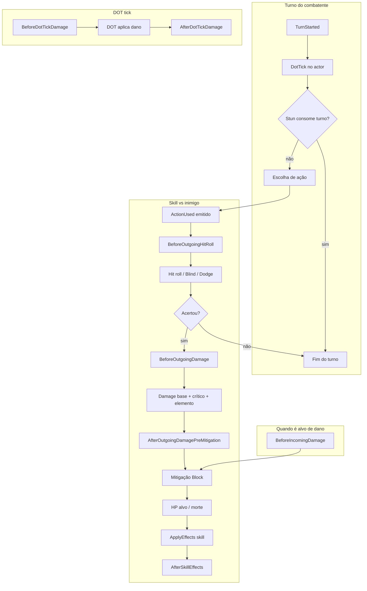

# Sistema de talentos e passivas — especificação

Documento de desenho para integração futura com `BattleSimulator` e dados em `Game.Simulations/Data/`. **Estado atual:** `skill_trees.json` define nós `Passive` / `Active`; `SkillTreeRules` valida desbloqueio; `Progression.UnlockedNodes` guarda o estado — **as passivas não alteram o combate**.

---

## 1. Objetivos

| Meta | Como |
|------|------|
| Extensível | Novas passivas = dados + registo de regra, não `switch` no simulador |
| Testável | Regras puras ou com `IRandomSource` injetado; testes por `PassiveEffectKind` |
| Fronteira dados/código | JSON descreve **o quê**; C# descreve **como** aplicar |
| Sem duplicar ativas | Efeitos que já existem em `EffectSpec` / skills preferem **reutilizar** o mesmo pipeline (tokens, DOT, etc.) via modificadores ao redor dele |

---

## 2. Compatibilidade com `skill_trees.json`

**Sem breaking change na v1:** manter o formato atual por nó:

```json
{ "id": "f_t1_p1", "type": "Passive", "cost": 1, "requires": [] }
```

**Extensão opcional (v1.1):** ficheiro paralelo ou secção opcional por personagem, ex. `passives.json`:

```json
{
  "passives": [
    {
      "id": "f_t1_p1",
      "effectKind": "OutgoingDamageSkillTag",
      "parameters": { "skillId": "wulfric_innate_cleave", "damageMultiplierAdditive": 0.10 }
    }
  ]
}
```

- O `id` **deve** coincidir com o `id` do nó `Passive` na árvore.
- O loader valida: todo `Passive` com `effectKind` obrigatório após migração; até lá, passivas sem definição = **no-op** + log em debug.

**Runtime no `Combatant`:** manter `UnlockedNodes` como fonte de verdade. Opcionalmente cache:

- `HashSet<string> UnlockedPassiveIds` derivado de nós com `type == Passive` e `UnlockedNodes[id] == true`, **ou**
- snapshot `PassiveModifierAccumulator` recalculado ao desbloquear (fora de combate) — útil se no futuro houver muitas passivas **estáticas** (ex.: +5% dano sempre).

**Recomendação MVP:** lista de ids desbloqueados + resolução **lazy por hook** no combate (menos risco de dessincronizar com respec).

---

## 3. Hooks no fluxo de combate

Ordem sugerida de avaliação (passivas **do ator** e, quando aplicável, **do alvo**). Números = ordem relativa dentro do mesmo sub-passo.



### Tabela de hooks (nome estável para código)

| Hook | Momento | Quem avalia (tipicamente) |
|------|---------|---------------------------|
| `TurnStartedSelf` | Após `TurnStarted`, antes de DOT no actor | Self |
| `BeforeDotTickDamage` | Antes de cada tick de DOT neste actor | Self (DOT no alvo) |
| `AfterDotTickDamage` | Depois do tick | Self |
| `BeforeOutgoingHitRoll` | Depois `ActionUsed`, antes de Blind/accuracy | Atacante |
| `BeforeOutgoingDamage` | Dano rolado, antes de multiplicadores finais de passiva | Atacante |
| `AfterOutgoingDamagePreMitigation` | Antes de Block/BlockPlus | Atacante / Alvo conforme regra |
| `BeforeIncomingDamage` | Alvo, antes de mitigação | Alvo |
| `AfterIncomingDamage` | Alvo, depois de aplicar dano | Alvo |
| `AfterSkillEffectsResolved` | Depois de `ApplyEffects` da skill | Atacante (e alvo se necessário) |
| `OnCombatantDowned` | Morte de combatente | Todos com reação global (futuro) |

**MVP:** implementar só `BeforeOutgoingDamage`, `BeforeIncomingDamage`, `AfterSkillEffectsResolved` e, se necessário para Bleed, `BeforeDotTickDamage`.

---

## 4. Tipos de efeito — v1 (poucos, fechados)

Código sugerido: enum `PassiveEffectKind` (ver `Game.Core/Passives/PassiveSystemContracts.cs`).

| Kind | Parâmetros (exemplo) | Comportamento |
|------|----------------------|---------------|
| `OutgoingDamageVsSkillId` | `skillId`, `multiplierAdditive` | Se `skill.Id == skillId`, `damage *= (1 + additive)` |
| `OutgoingDamageVsDotOnTarget` | `dotType`, `multiplierAdditive`, `cap` | Se alvo tem DOT ativo daquele tipo, aplicar bónus com cap |
| `DotDurationBonus` | `dotType`, `extraTurns`, `maxTotalDuration` | Ao aplicar DOT via skill, +turnos até cap |
| `TokenStacksOnSelfWhen` | condição simples, `token`, `stacks` | Ex.: ao usar skill X, +Block (condição codificada na regra) |
| `IncomingDamageMultiplierWhen` | `hpBelowPercent`, `multiplier` | Se HP &lt; limiar, reduzir dano recebido |

**Fora do MVP v1:** reações “ao ser acertado aplicar Bleed no atacante”, “−1 CD ao matar” (exige hook + estado de cooldown nas passivas), sinergias entre árvores.

**Regra de ouro:** se o efeito é **idêntico** a um `EffectSpec` já usado por uma ativa, prefira **não** duplicar — ou a passiva concede um **buff de token** no hook certo, ou ajusta números num único sítio (`BalanceConfig` + modificador).

---

## 5. Stacking e ordem

1. **Base** (dano da skill, valores do JSON).  
2. **Passivas** (aditivo primeiro, depois multiplicativo por “camada”, conforme abaixo).  
3. **Tokens temporários** (Block, etc.) — já no simulador.  
4. **Equipamento** (futuro) — mesma interface que passivas, prioridade após passivas ou antes; **fixar na doc** quando existir equipamento.

**Stacking sugerido:**

- Vários `multiplierAdditive` da mesma “categoria” (ex.: dano Fire): **somar** e depois `min(sum, capCategory)`.
- `multiplierMultiplicative`: **multiplicar** em cadeia, `clamp` final (ex. 0,25–3,0).

Documentar por `PassiveEffectKind` se admite stack de múltiplas fontes.

---

## 6. Separação de responsabilidades

| Camada | Responsabilidade |
|--------|------------------|
| `CombatDataLoader` | Carregar `passives.json` (futuro), validar ids referenciam nós Passive existentes |
| `SkillTreeRules` | Continua a validar **desbloqueio**; não aplica combate |
| `PassiveRuleRegistry` | `PassiveId → IPassiveRule` (registo em startup ou source-generated) |
| `BattleSimulator` | Em cada **hook**, chamar `PassivePipeline.Apply(hook, ref accumulator, context)` |
| `IPassiveRule` | Implementação pequena por `PassiveEffectKind` ou por id |

Evitar um `switch` gigante no simulador: **um** `switch` ou dicionário em `PassivePipeline` que delega para handlers por `PassiveEffectKind`; passivas “especiais” podem ser classe dedicada registada por id.

---

## 7. Performance e determinismo

- Qualquer RNG (ex.: “30% de aplicar X”) **obrigatoriamente** via `IRandomSource` já injectado no simulador.
- Não usar `Random.Shared` dentro de regras de passiva.
- Por turno, limitar recomputações: cache por actor `List<IPassiveRule> resolvedFromUnlockedIds` no início da batalha ou ao primeiro hook.

---

## 8. Testes

| Tipo | Exemplo |
|------|---------|
| Unitário | Dado alvo com Bleed, passiva `OutgoingDamageVsDotOnTarget` +10%, dano base 10 → esperado 11 |
| Unitário | `DotDurationBonus` +1 turno, cap 5, DOT inicial 3 → duração 4 |
| Integração | `UnlockedNodes["f_t1_p1"] = true`, carregar regra mock, uma `ResolveAction` → `DamageApplied` reflete bónus |
| Regressão | Simulação com seed fixo: assinatura de eventos inalterada quando nenhuma passiva desbloqueada |

---

## 9. Convenções e documentação para designers

- IDs de nó: `{elementLetter}_t{tier}_{p|a}{index}` — ex. `f_t1_p1`, `m_t2_a1`.
- Cada passiva documentada em `docs/wulfric-skill-trees.md` (efeito em linguagem natural) + entrada em `passives.json` (efeito em dados).
- README: link para este ficheiro na secção de dados.

---

## 10. Riscos e mitigação

| Risco | Mitigação |
|-------|-----------|
| Duplicar lógica das skills ativas | Passivas alteram **modificadores** ou **gatilhos**; efeitos complexos continuam em `EffectSpec` |
| Ordem errada de hooks | Tabela fixa + testes de integração por hook |
| Exploit de stacking | Caps por categoria + telemetria nas simulações CSV |
| JSON sem schema | JSON Schema opcional em `docs/schemas/passives.schema.json` (fase 2) |
| Árvores multi-personagem | `passives.json` por `characterId` ou chave composta `wulfric:f_t1_p1` |

---

## 11. Plano de implementação (acionável)

1. **Fase 0 (feito):** contratos C# + esta spec; simulador inalterado.  
2. **Fase 1:** `passives.json` + loader; `PassiveRuleRegistry` com 1–2 `PassiveEffectKind`; integrar **só** `BeforeOutgoingDamage` no `BattleSimulator`.  
3. **Fase 2:** `BeforeIncomingDamage` + testes de integração com seed.  
4. **Fase 3:** hooks de DOT + passivas de Bleed/Blight do Wulfric.  
5. **Fase 4:** UI Unity apenas consome `UnlockedNodes` + mesmos ids (fora de `Game.Core`).

---

## 12. Referência de código

Interfaces e enum de hooks: `Game.Core/Passives/PassiveSystemContracts.cs` (contratos; integração no simulador nas fases acima).
